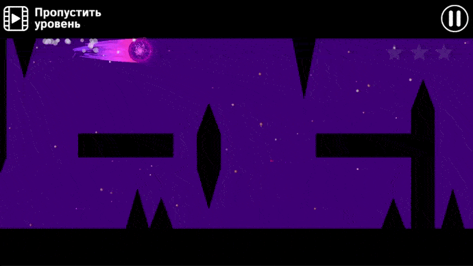
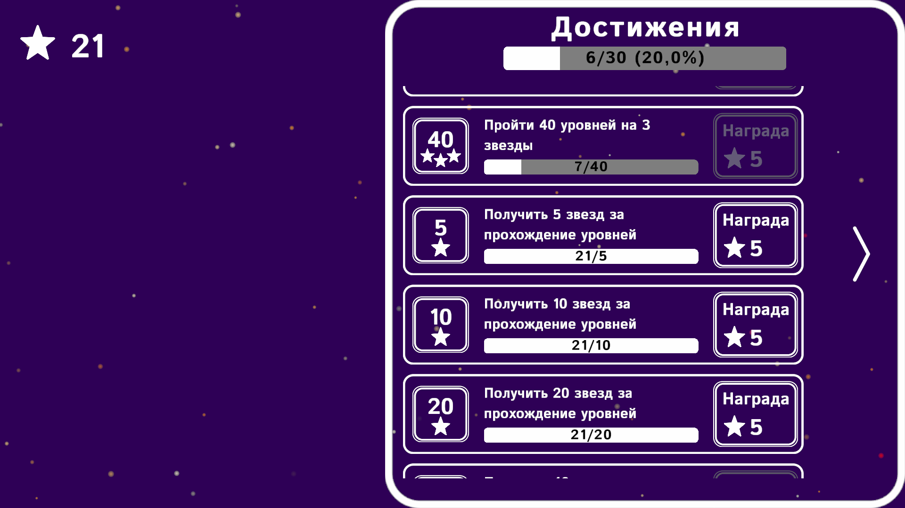
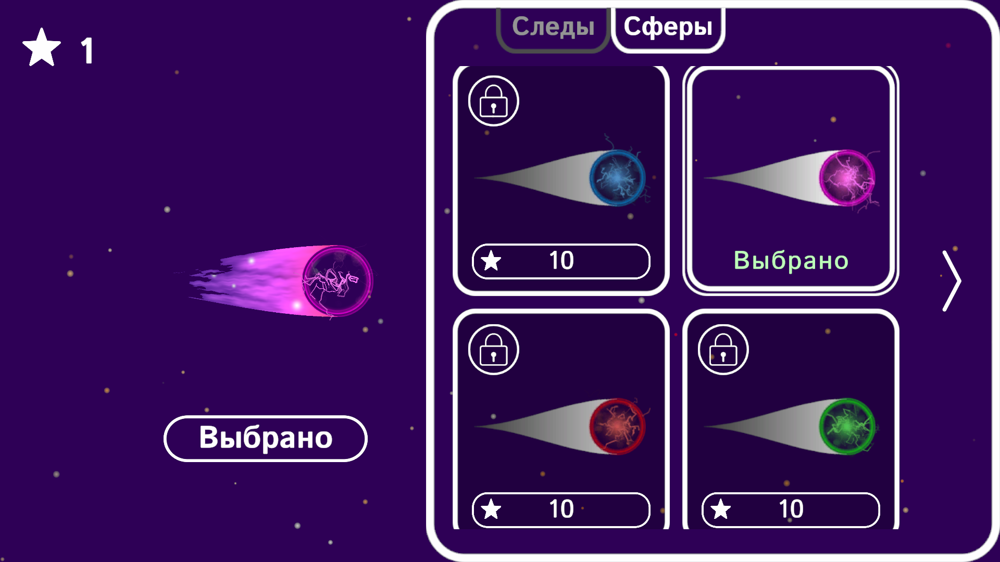
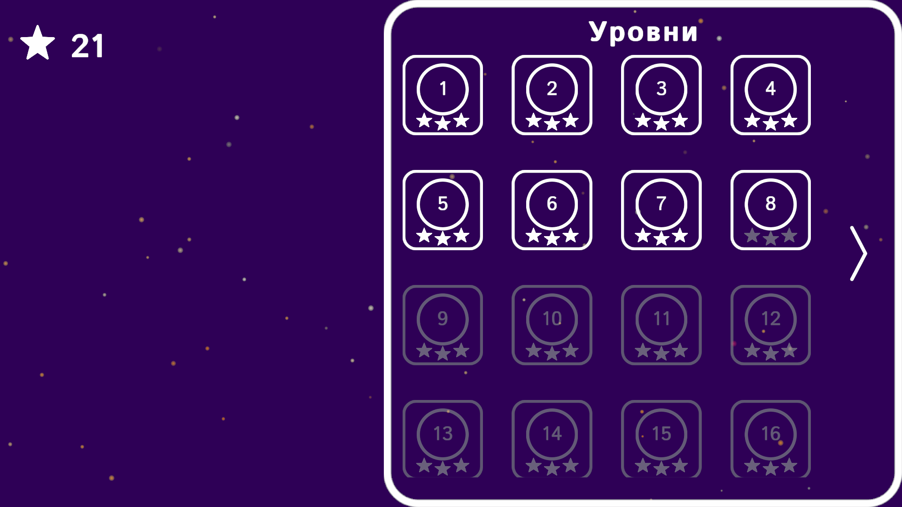
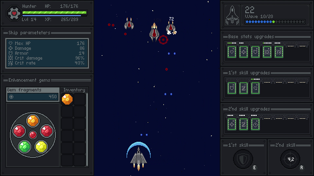
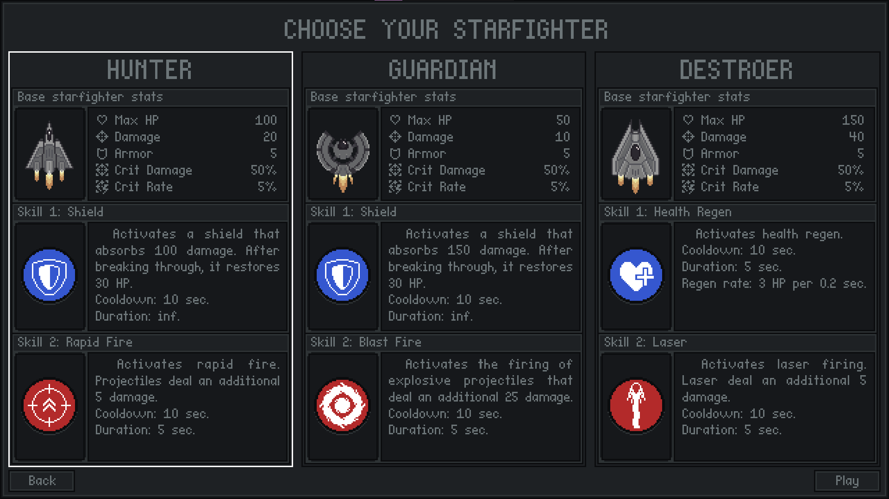
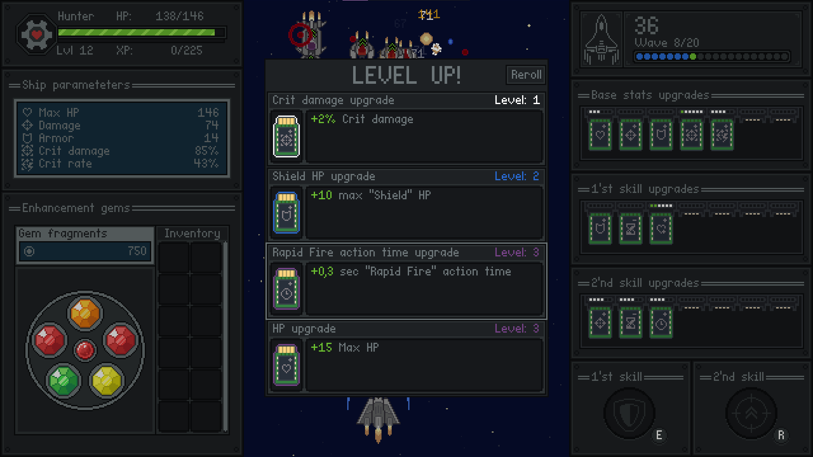
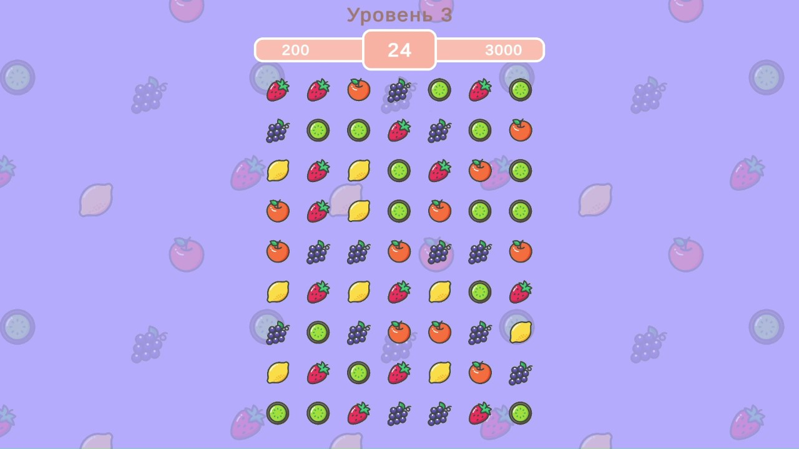
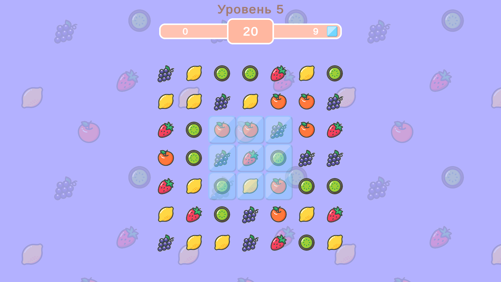
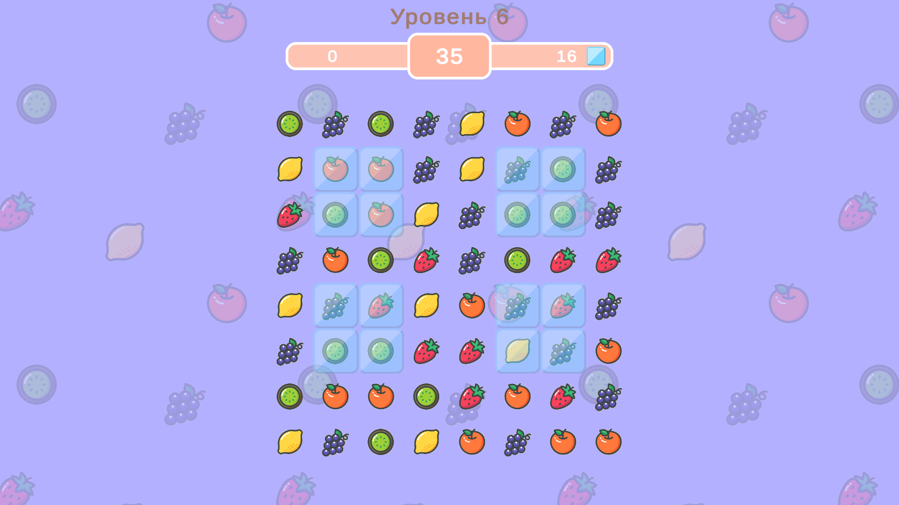

# Unity3D | C# | Портфолио
## Проекты
### Simple Platformer

Минималистичный платформер с системой достижений и магазином для покупки скинов. В проект интегрирована Yndex SDK. Игра состоит из 40 уровней.

Ссылки:
- GitHub - https://github.com/CyrAXwell/Simple-Platformer
- Itch.io - https://syraxwell.itch.io/simple-platformer

  
Скриншоты 

  

  
  
  
  

### Space Shooter

Вертикальный космический shoot ’em up. В игре имеются 3 персонажа с различными умениями на выбор. В игре реализована система "апгрейдов" и система "реликвий"  для повышения характеристик персонажей. В игре нужно продержаться 20 волн и победить финального босса.

Ссылки:
- GitHub - https://github.com/CyrAXwell/Space-Shooter
- Itch.io - https://syraxwell.itch.io/spase-shooter

  
Скриншоты 

  

  
  
  
  

### Match3

Игра в жанре Match3. В проект интегрирована Yndex SDK. Для игры был также написан редактор уровней и бот для тестирования уровней.

Ссылки:
- GitHub - https://github.com/CyrAXwell/Match3
- Itch.io - https://syraxwell.itch.io/fruits-and-berries-match3
- Яндекс игры - https://yandex.ru/games/app/357374?lang=ru

  
Скриншоты 

  

  
  
  
  

