# Unity3D | C# | Портфолио
## Проекты

### Tower Defense (DOTS)
Игра в жанре Tower Defense.

Игра сделана с использованием DOTS  (ECS, burst compiler, job system). Основные механики, такие как перемещение юнитов, поиск цели, стрельба и способности персонажа сделаны при помощи unity DOTS. Анимация была реализована гибридным методом, при котором для каждой сущности (entitie), создавался отдельный игровой объект (GameObject), который анимировался стандартными средствами unity.

Ссылки:
- GitHub - https://github.com/CyrAXwell/Tower_Defense
- Itch.io - https://syraxwell.itch.io/tower-defense

  
Скриншоты: 

  

  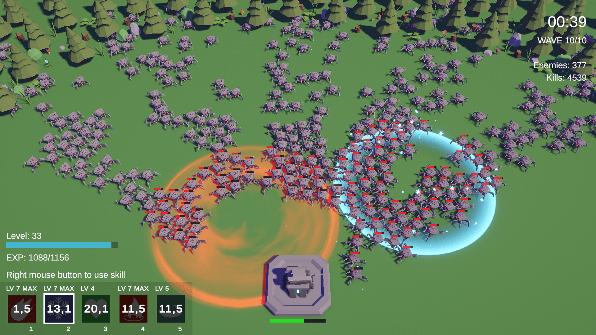
  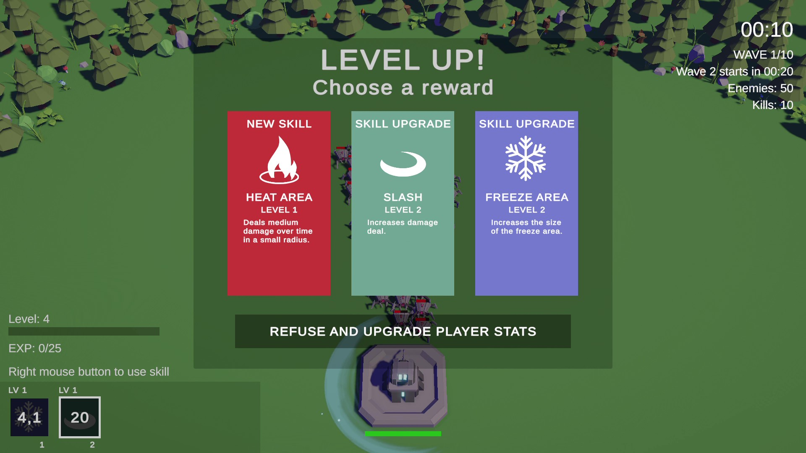
  

### Pong (multiplayer)
Классический Pong.

Игра поддерживает одиночную игру против бота и мультиплеер на одном устройстве и по сети. Мультиплеер реализован при помощи Netcode for GameObjects и сервисов unity Lobby и unity Relay. Netcode for GameObjects использовался для синхронизации дынных между клиентом и хостом. При помощи unity Lobby было реализовано создание лобби для поиска и подключения других игроков. Unity Relay использовался для создания пиринговой сети для подключения игроков без необходимости выделения отдельных серверов.

Ссылки:
- GitHub - https://github.com/CyrAXwell/Pong
- Itch.io - https://syraxwell.itch.io/pong

  
Скриншоты: 

  

  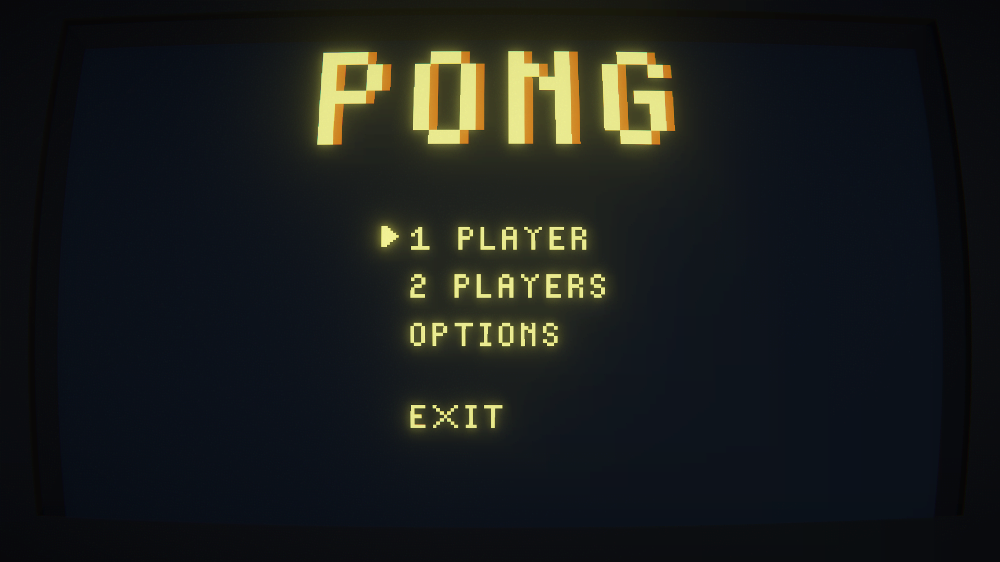
  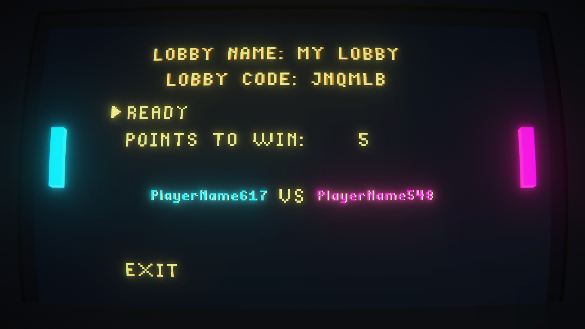
  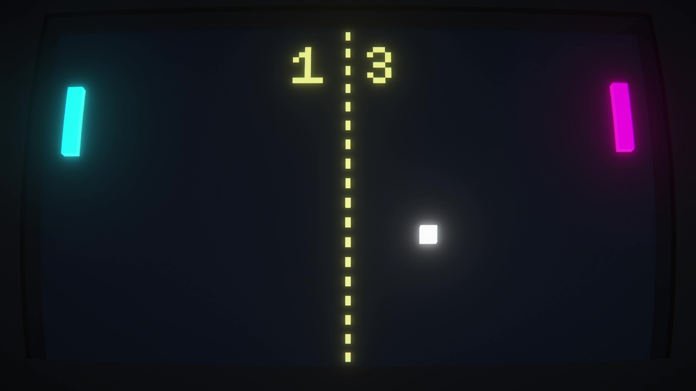
  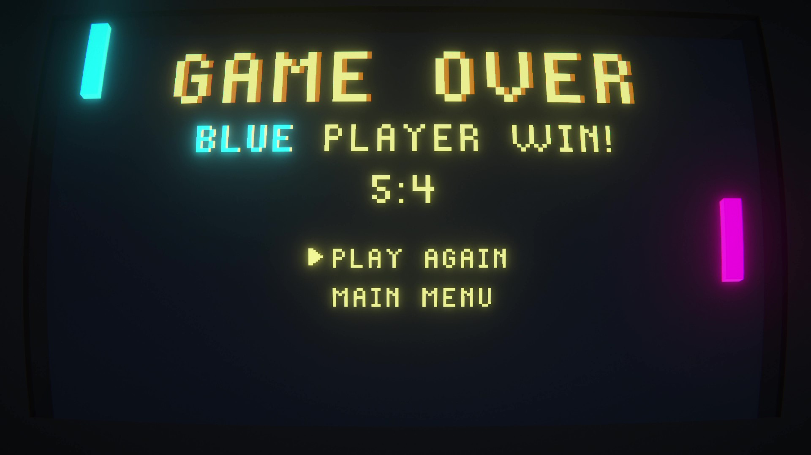
  

###  Match 3
Браузерная игра в жанре три в ряд.

В игру интегрирована Yndex SDK, игра была выложена на платформу Яндекс Игры. При помощи Yndex SDK  в игру была интегрирована реклама и лидерборды.  Для игры был также написан редактор уровней и бот для тестирования уровней. Анимации были реализованы при помощи DOTween.

Ссылки:
- GitHub - https://github.com/CyrAXwell/Match3
- Itch.io - https://syraxwell.itch.io/fruits-and-berries-match3

  
Скриншоты: 

  

  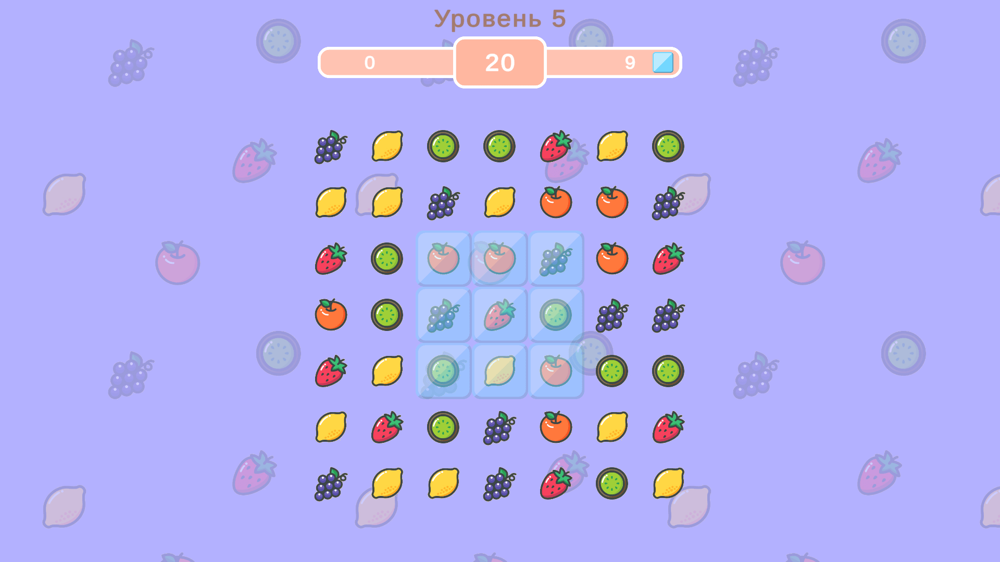
  

###  Bubble Shooter
Браузерная аркадная игра головоломка в жанре Bubble shooter.

В игру интегрирована Yndex SDK. При помощи Yndex SDK была интегрирована реклама и лидерборды. Анимации реализованы при помощи DOTween.

Ссылки:
- GitHub - https://github.com/CyrAXwell/Bubble_shooter
- Itch.io - https://syraxwell.itch.io/bubble-shooter

  
Скриншоты: 

  

  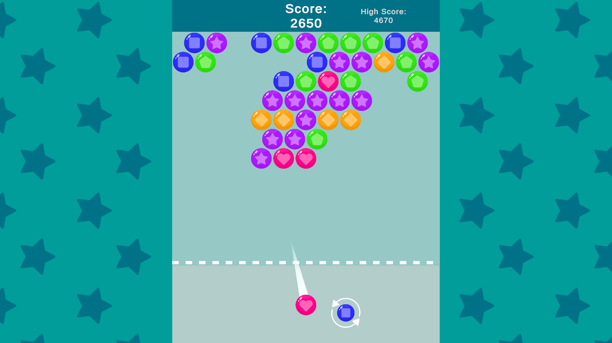
  

### Pop The Balls
Браузерная аркадная игра головоломка в жанре tile-matching video game.

В игру интегрирована Yndex SDK. При помощи Yndex SDK была интегрирована реклама и лидерборды. Анимации реализованы при помощи DOTween.

Ссылки:
- GitHub - https://github.com/CyrAXwell/Pop_the_balls
- Itch.io - https://syraxwell.itch.io/pop-the-balls

  
Скриншоты: 

  

  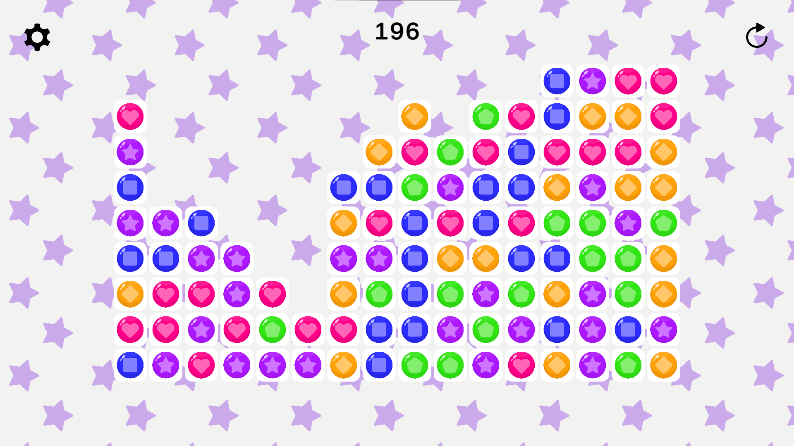
  

### Simple Platformer
Браузерный минималистичный платформер.

В проект интегрирована Yndex SDK. В игре реализована система достижений и магазин для покупки скинов. Игра состоит из 40 уровней. Сохранения сделаны через json файлы.

Ссылки:
- GitHub - https://github.com/CyrAXwell/Simple-Platformer
- Itch.io - https://syraxwell.itch.io/simple-platformer

  
Скриншоты: 

  

  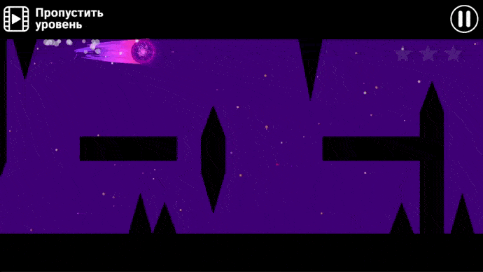
  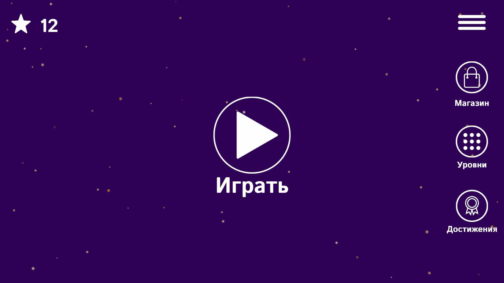
  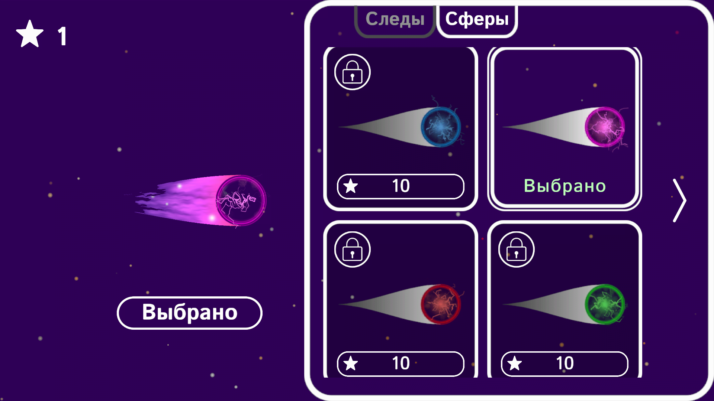
  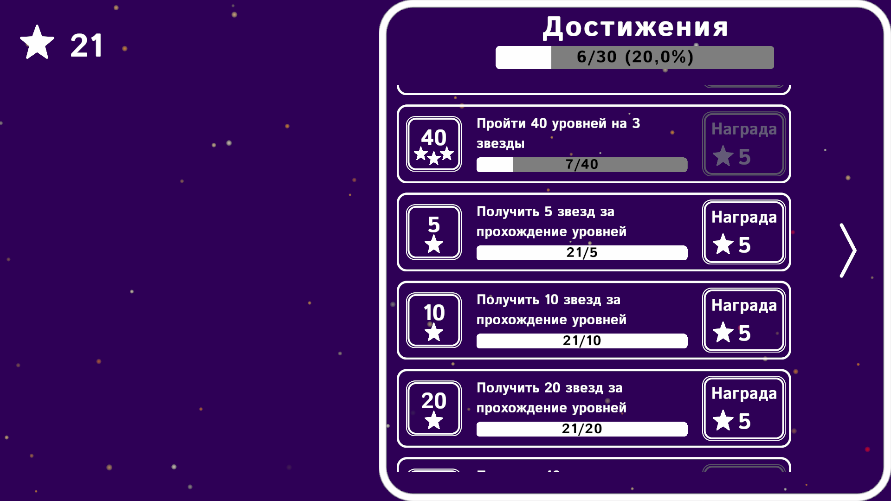
  

### Red-heat-gift-rescue (Gamega Game Jam)
Аркадная игра сделанная в рамках Gamega Game Jam.

Это бесконечная аркадная игра на максимальный счет. Бегай по ледяному лабиринту, собирай подарки и уворачивайся от огненных лучей.

Ссылки:
- GitHub - https://github.com/CyrAXwell/Gamega-Jam-Game
- Itch.io - https://syraxwell.itch.io/red-heat-gift-rescue

  
Скриншоты: 

  

  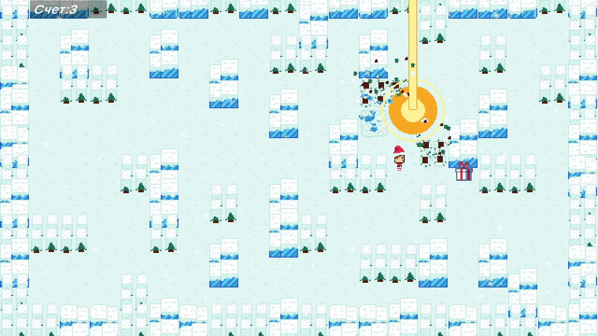
  

### Space Shooter
Вертикальный космический shoot ’em up. 

В игре имеются 3 персонажа с различными умениями на выбор. В игре реализована система "апгрейдов" и система "реликвий" для повышения характеристик персонажей. Цель игры - продержаться 20 волн и победить финального босса.

Ссылки:
- GitHub - https://github.com/CyrAXwell/Space-Shooter
- Itch.io - https://syraxwell.itch.io/spase-shooter

  
Скриншоты: 

  

  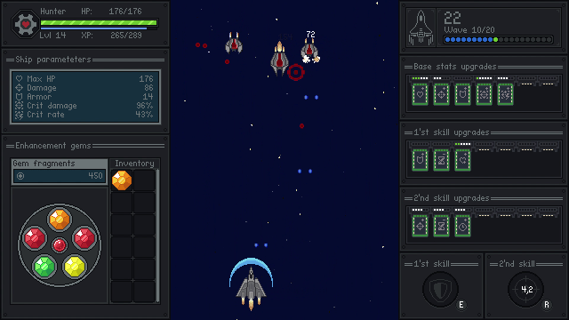
  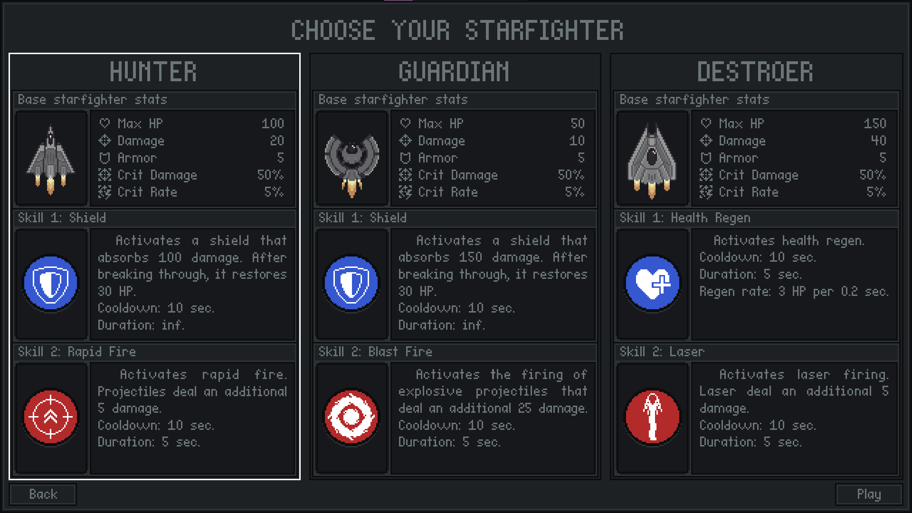
  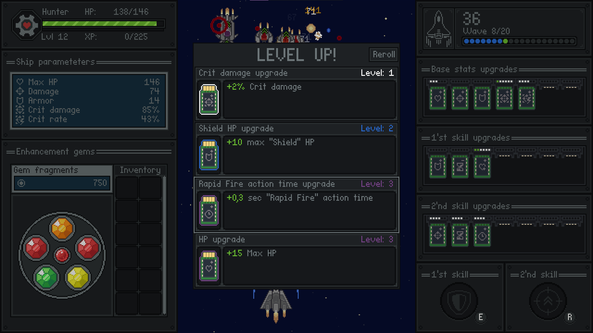
  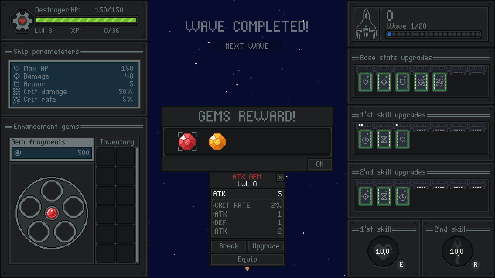
  

